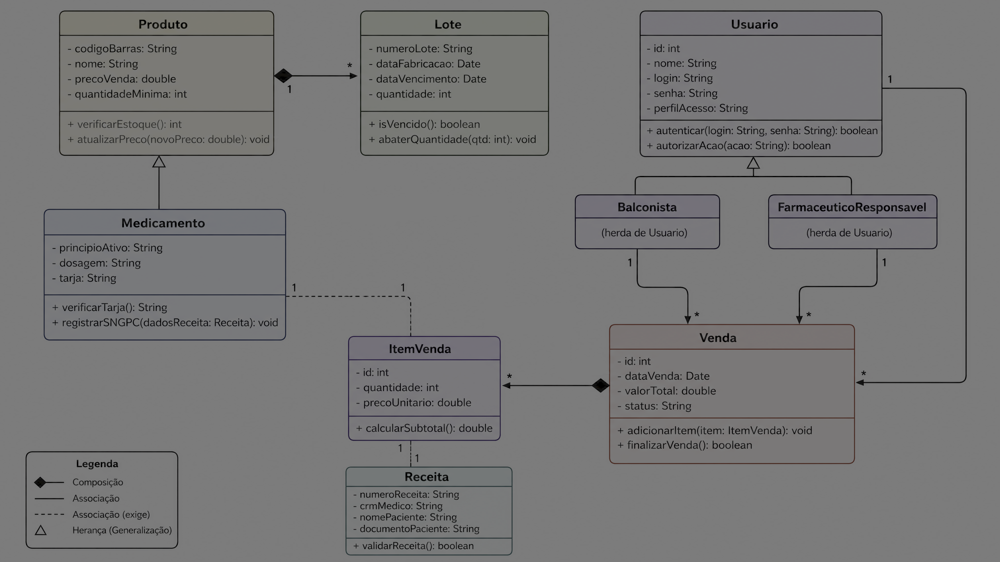

# Relatório da Atividade Assíncrona: Diagrama de Classes e Mapeamento para Código

## Introdução

Este relatório apresenta os entregáveis da atividade assíncrona de Engenharia de Software I, focando na modelagem de um Diagrama de Classes para o *Sistema de Gestão de Estoque para Farmácias* e no mapeamento de classes selecionadas para código Python. As decisões de design foram baseadas no *Documento de Elicitação de Requisitos* fornecido, garantindo consistência com os requisitos funcionais, não funcionais e regras de negócio do projeto.

## Entregável 01: Diagrama de Classes do Projeto Integrador

O Diagrama de Classes foi desenvolvido utilizando a notação UML, conforme as diretrizes da Aula 10 sobre "UML: Diagrama de Classes" [1]. Ele representa a estrutura estática do sistema, mostrando as classes, seus atributos, métodos e os relacionamentos entre elas. Foram incluídas classes essenciais para o domínio de farmácia, como `Produto`, `Medicamento`, `Lote`, `Usuario` (com especializações), `Venda`, `ItemVenda` e `Receita`.

### Requisitos Mínimos Atendidos:

*   **Mínimo 5 classes:** Foram criadas 8 classes principais (`Produto`, `Medicamento`, `Lote`, `Usuario`, `Balconista`, `FarmaceuticoResponsavel`, `Venda`, `ItemVenda`, `Receita`).
*   **Cada classe com pelo menos 3 atributos e 2 métodos:** Todas as classes atendem a este requisito, com atributos tipados e métodos com parâmetros e retorno, quando aplicável.
*   **Visibilidade correta:** Atributos são privados (`-`) e métodos são públicos (`+`), seguindo a regra de encapsulamento [1].
*   **Multiplicidade em TODOS os relacionamentos:** A multiplicidade foi especificada em todas as associações, composições e heranças.
*   **Pelo menos 1 composição ou agregação:** Uma composição (`Produto --* Lote`) foi utilizada para representar a forte dependência do lote em relação ao produto.
*   **Pelo menos 1 herança:** A classe `Medicamento` herda de `Produto`, e `Balconista` e `FarmaceuticoResponsavel` herdam de `Usuario`, demonstrando especialização.
*   **Consistência com User Stories e Diagrama de Casos de Uso:** O diagrama reflete os conceitos e interações descritos no *Documento de Elicitação de Requisitos*, como o controle de medicamentos controlados e o fluxo de vendas.

### Diagrama de Classes:


## Entregável 02: Mapeamento Classes → Código (Python)

Duas classes do diagrama, `Medicamento` e `Lote`, foram selecionadas e traduzidas para código Python. Este mapeamento demonstra a compreensão de que o diagrama de classes serve como um blueprint para a implementação do software, onde cada elemento do diagrama tem uma correspondência direta no código [1].

### Classe `Medicamento` (Herança de `Produto`)

```python
class Produto:
    def __init__(self, codigo_barras: str, nome: str, preco_venda: float, quantidade_minima: int):
        self.__codigo_barras = codigo_barras  # Atributo que representa o código de barras do produto
        self.__nome = nome  # Atributo que representa o nome do produto
        self.__preco_venda = preco_venda  # Atributo que representa o preço de venda do produto
        self.__quantidade_minima = quantidade_minima  # Atributo que representa a quantidade mínima em estoque

    def verificar_estoque(self) -> int:
        # Lógica para verificar o estoque (seria implementada com a classe Lote)
        return 0

    def atualizar_preco(self, novo_preco: float): 
        self.__preco_venda = novo_preco

    @property
    def codigo_barras(self) -> str:
        return self.__codigo_barras

    @property
    def nome(self) -> str:
        return self.__nome

    @property
    def preco_venda(self) -> float:
        return self.__preco_venda

    @preco_venda.setter
    def preco_venda(self, valor: float):
        if valor > 0:
            self.__preco_venda = valor
        else:
            raise ValueError("O preço de venda deve ser positivo.")

    @property
    def quantidade_minima(self) -> int:
        return self.__quantidade_minima

    @quantidade_minima.setter
    def quantidade_minima(self, valor: int):
        if valor >= 0:
            self.__quantidade_minima = valor
        else:
            raise ValueError("A quantidade mínima não pode ser negativa.")


class Medicamento(Produto):
    def __init__(self, codigo_barras: str, nome: str, preco_venda: float, quantidade_minima: int, 
                 principio_ativo: str, dosagem: str, tarja: str):
        super().__init__(codigo_barras, nome, preco_venda, quantidade_minima)
        self.__principio_ativo = principio_ativo  # Atributo que representa o princípio ativo do medicamento
        self.__dosagem = dosagem  # Atributo que representa a dosagem do medicamento
        self.__tarja = tarja  # Atributo que representa a tarja do medicamento (vermelha, preta, etc.)

    def verificar_tarja(self) -> str:
        # Método de negócio: Retorna a tarja do medicamento
        return self.__tarja

    def registrar_sngpc(self, dados_receita):  # dados_receita seria um objeto da classe Receita
        # Lógica para registrar dados no SNGPC (Sistema Nacional de Gerenciamento de Produtos Controlados)
        print(f"Registrando medicamento {self.nome} no SNGPC com dados da receita.")

    @property
    def principio_ativo(self) -> str:
        return self.__principio_ativo

    @principio_ativo.setter
    def principio_ativo(self, valor: str):
        self.__principio_ativo = valor

    @property
    def dosagem(self) -> str:
        return self.__dosagem

    @dosagem.setter
    def dosagem(self, valor: str):
        self.__dosagem = valor

    @property
    def tarja(self) -> str:
        return self.__tarja

    @tarja.setter
    def tarja(self, valor: str):
        self.__tarja = valor
```

### Classe `Lote`

```python
import datetime

class Lote:
    def __init__(self, numero_lote: str, data_fabricacao: datetime.date, data_vencimento: datetime.date, quantidade: int):
        self.__numero_lote = numero_lote  # Atributo que representa o número identificador do lote
        self.__data_fabricacao = data_fabricacao  # Atributo que representa a data de fabricação do lote
        self.__data_vencimento = data_vencimento  # Atributo que representa a data de vencimento do lote
        self.__quantidade = quantidade  # Atributo que representa a quantidade de itens neste lote

    def is_vencido(self) -> bool:
        # Método de negócio: Verifica se o lote está vencido comparando com a data atual
        return datetime.date.today() >= self.__data_vencimento

    def abater_quantidade(self, qtd: int):
        # Método de negócio: Abate uma quantidade do estoque do lote
        if self.__quantidade >= qtd:
            self.__quantidade -= qtd
        else:
            raise ValueError("Quantidade a abater maior que a disponível no lote.")

    @property
    def numero_lote(self) -> str:
        return self.__numero_lote

    @property
    def data_fabricacao(self) -> datetime.date:
        return self.__data_fabricacao

    @property
    def data_vencimento(self) -> datetime.date:
        return self.__data_vencimento

    @property
    def quantidade(self) -> int:
        return self.__quantidade

    @quantidade.setter
    def quantidade(self, valor: int):
        if valor >= 0:
            self.__quantidade = valor
        else:
            raise ValueError("A quantidade não pode ser negativa.")
```

## Entregável 03: Justificativa de Decisões

### Por que essas classes foram escolhidas e como derivaram das User Stories?

As classes **Produto**, **Medicamento**, **Lote**, **Usuario**, **Balconista**, **FarmaceuticoResponsavel**, **Venda**, **ItemVenda** e **Receita** foram escolhidas com base nos Requisitos Funcionais (RFs) e Regras de Negócio (RNs) detalhados no *Documento de Elicitação de Requisitos*. Por exemplo, a classe `Medicamento` e sua herança de `Produto` são diretamente influenciadas pelos RF01 (Cadastro de Medicamentos e Produtos) e RF06 (Controle de Medicamentos Controlados). A classe `Lote` é crucial para o RF02 (Controle de Lote e Validade) e a RN02 (Método FEFO), enquanto `Venda` e `ItemVenda` suportam o fluxo principal de vendas. As classes de `Usuário` (e suas especializações) são essenciais para o controle de acesso e responsabilidades, como a aprovação de vendas de controlados pelo `FarmaceuticoResponsavel`.

### Qual relacionamento foi mais difícil de decidir e por quê?

O relacionamento entre `Produto` e `Lote` foi o mais desafiador. Optou-se por uma **composição** (`Produto --* Lote`), indicando que um `Lote` não existe sem um `Produto` associado e que sua existência é fortemente dependente. Embora um produto possa ter múltiplos lotes, a vida útil de um lote está intrinsecamente ligada ao produto que ele representa. Esta escolha reflete a regra de negócio de que o controle de lote e validade é fundamental e que cada lote é uma parte integrante e indissociável do inventário de um produto específico, não podendo ser realocado para outro produto.

### Se o sistema crescer, que novas classes precisariam ser adicionadas? O design atual permite isso facilmente?

O design atual é extensível. Se o sistema crescer, novas classes poderiam incluir: `Fornecedor` (para gerenciar a importação de XML - RF03), `Relatorio` (para agrupar funcionalidades de RF04 e RF05), `Cliente` (para programas de fidelidade ou histórico de compras), e `Promocao` (para gerenciar ofertas baseadas em vencimento - RF04). A estrutura de herança (`Medicamento` de `Produto`) e as associações existentes facilitam a adição dessas novas entidades sem grandes refatorações, mantendo a coesão e o baixo acoplamento. Por exemplo, a adição de `Fornecedor` se integraria facilmente com a importação de notas fiscais, e `Cliente` poderia ser associado a `Venda`.

## Referências

[1] Aula 10 — UML: Diagrama de Classes. Disponível em: [file:///home/ubuntu/trabalho/Trabalho/dados/aula10_diagrama_de_classes.html](file:///home/ubuntu/trabalho/Trabalho/dados/aula10_diagrama_de_classes.html)
